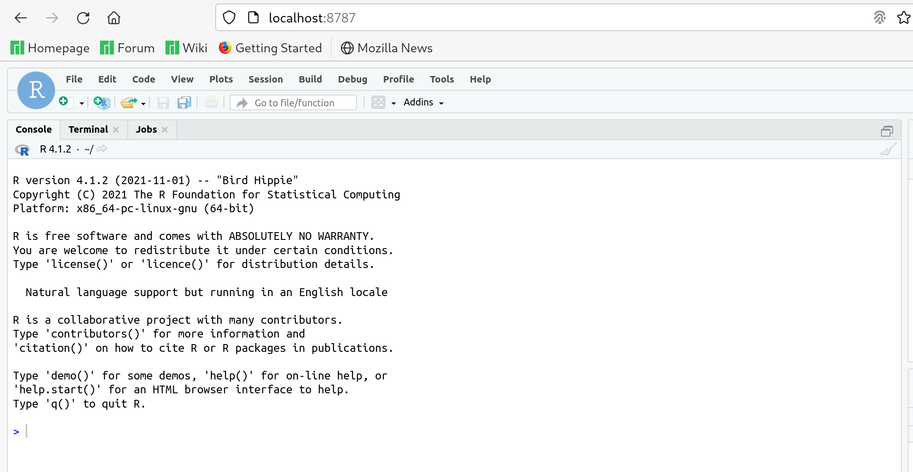

I teach Introduction to Data Science at a major public university. At
the beginning of each semester I tell my students that they will be
shocked at what I don't know about statistics, which is a roundabout
way of telling them that a _lot_ of data science has little to do with
data or science.

(I also tell them that A Data Scientist is a statistician after you
remove reason and accountability. Most of my students are
biostatisticians. It pays to know your audience.)

About half of what the course covers is the technologies around data
science. The story I tell is that I want students to be able to
reproduce a specific result from a specific moment in their data
analysis, even if they need to do it years later. Docker, git and Make
therefor constitute the main part of that side of the course.

Despite the fact that the university provides infrastructure for us to
run docker containers and the fact that my own students all have
laptops of one sort or another, almost everyone struggles with their
infrastructure. Getting Docker running on Windows is a common problem
and this year, with the introduction of Apple Silicon, getting a
development environment going on a Mac has proven difficult for many
students as well.

And even if all those technical hurdles are lept, students may
eventually want to move beyond either the technical or social
limitations of their local machines.

Digital Ocean
=============

I was approached by Digital Ocean to write a tutorial about how I'd
set up a development environment for doing data science using their
services. While I've never used DO before, my brother is a customer
(he built [Orb.church](https://orb.church/#main) on their
infrastructure). 

Although I try my best to support students on all platforms, the focus
of the class is Linux, so our first step is to set up a Windows
VM. Digital Ocean already has [tutorials covering this
material](https://docs.digitalocean.com/products/droplets/how-to/create/),
but we can rush through here:

We visit our project dashboard, "Droplets" and then we just click the
giant button that says "Create Droplet."


For now we're going to just create your basic machine. One thing we
probably want to deal with right now is adding some block storage. If
we work on such a virtual disk, we can always spin up a beefier
droplet later if we need to do bigger tasks. For most of my course,
however, students are doing small-to-mid sized data science tasks. For
most of these we can get away with a small machine.


One of the goals of my course is to get the students "over the hump"
of dealing with confusing Unixy stuff and thus I make everyone use ssh
keys where appropriate. Here is one such case. 

Since modern versions of Windows support ssh in Powershell, the
instructions for generating keys are more or less the same on any
platform. In your terminal of choice:

```
[toups@meso digital-ocean]$ ssh-keygen 
Generating public/private rsa key pair.
Enter file in which to save the key (/home/toups/.ssh/id_rsa): ./digital-ocean-tutorial
Enter passphrase (empty for no passphrase): 
Enter same passphrase again: 
Your identification has been saved in ./digital-ocean-tutorial
Your public key has been saved in ./digital-ocean-tutorial.pub
The key fingerprint is:
SHA256:******************************************* toups@meso
The key's randomart image is:
+---[RSA 3072]----+
|*****************|
|*****************|
|*****************|
|*****************|
|*****************|
|*****************|
|*****************|
|*****************|
|*****************|
+----[SHA256]-----+
```

The hand waving explanation for what an ssh key pair goes like this:

Its a pair of numbers: a public one and a private one. If I have the
private one and you have the public one, I can prove to you I have the
private one without giving it to you. We're going to upload our public
key (which we can pass around willy nilly, which is why its called
public) and then, whenever we want to connect to our server, we can
prove its us using the private key, which we never share with anyone. 


Finally, let's add a tag to our VM. This is going to make it easier to
understand billing if life ever gets complicated and we can also use
the tag to enforce some firewall rules (see below).


I've used a tag "dods" for "Digital Ocean Data Science."

We'll just use the default options for everything else and click
"Create Droplet."

After a surprisingly short delay (less than a minute!) we can connect
to our droplet by copying its IP address and saying:


Now that we've got root access to our machine we're going to go ahead
and do a little security work just to make our lives a little
safer. Right now anyone can _try_ to ssh into our machine. If we're
silly enough to put our private key somewhere people can see it, they
can get in, too.

To make things just a little more secure, we'd like to set up our
server to only respond to requests from our IP address. This reduces
the attack surface of our machine.

We can do this in a few ways, but DO provides something called a
"Cloud Firewall" which we can create and modify via DO's web
interface. This has the benefit that if we have to connect to our
machine from a new IP address, we can just log in to DO and modify our
rules from anywhere.

Use a convenient website like [ipchicken](https://ipchicken.com/) to
find your IP address and put it in the Inbound Rules section of the
page next to ssh. Delete the other two options to prevent other
traffic from talking to your server. This isn't perfect security, but
combined with our ssh key we should be a relatively thin target.


Now that we've created our Firewall.

HIT ME
======


I have a confession to make: I'm a console cowboy. A lot of data
science tutorials are all about Jupyter or RStudio, but the fact is I
do all my data science and just about most everything else from
Emacs. I encourage students to get comfortable on the command line,
since otherwise graphical user interfaces will form a ceiling for
their career. The justification for this idea is that data scientists
need at least two things to succeed: data and the means to get their
results in front of other people. If a data scientist has broad
technical skills they can do both of these things without relying on
other technical experts. Getting comfortable with the Unix command
line is the seed for those other technical skills.

So let's ssh to our machine.

I'm delighted that on new versions of Windows powershell supports the
ssh command right out of the box, so the instructions for connecting
to our Droplet are pretty uniform:

1. Go to the networking tab of your droplet and get its public IP
   address.
2. In a terminal:

```
ssh-agent add digital-ocean-tutorial # add your private key to the
#current ssh-agent
ssh root@<your-machine's-ip>
```

If all is well then you should be greeted with a terminal on your
machine. In the olden days we'd began the lugubrious process of
setting up this machine for whatever we were going to do with it. But
today we're just going to install Docker.

If you aren't familiar with system configuration, it can be hard to
understand what Docker is good for but its not too hard to
explain. When we do Data Science we depend on tools like Programming
Languages (R, Python) and libraries associated with those
languages. We may depend on other things more subtle (for example the
way a particular operating system handles time). It can be a lot of
work to set up a computer to support doing a particular data science
project, and not every project needs the same set of libraries. In
fact, some libraries or other systems may have trouble coexisting with
one another on the same machine.

In the past people would just try their best to get a useful
environment going and maybe they would try to document how they did it
so other people could also use their work. Most of the time this was
done poorly, and doing it right required quite a lot of expertise
which isn't easy to come by.

Docker is a tool which lets you describe an environment for doing work
in a sort of fixed format (a Dockerfile). Given this file, Docker can
recreate any particular system configuration you can make happen (and
do it repeatedly). Once these little systems are created, you connect
to them and do your work, comfortable in the more or less accurate
belief that you can easily reproduce your environment. 

An added benefit is that you can maintain many small environments for
many different projects, making taming complex dependencies much
easier. Even within one project, different steps might require
different environments, which you can also wrangle with Docker. 

For the working software person, Docker has a host of other benefits,
but for Data Scientists, these flexible, reproducible, shareable
environments are extremely useful.

Installing Docker
=================

Our Droplet is running Ubuntu.  We're just going to follow the
instructions from Docker for [installation on that operating
system](https://docs.docker.com/engine/install/ubuntu/).

```
apt-get update

apt-get install \
    ca-certificates \
    curl \
    gnupg \
    lsb-release
	
curl -fsSL https://download.docker.com/linux/ubuntu/gpg | sudo gpg --dearmor -o /usr/share/keyrings/docker-archive-keyring.gpg	

echo \
  "deb [arch=$(dpkg --print-architecture) signed-by=/usr/share/keyrings/docker-archive-keyring.gpg] https://download.docker.com/linux/ubuntu \
  $(lsb_release -cs) stable" | sudo tee /etc/apt/sources.list.d/docker.list > /dev/null
  
apt-get update
apt-get install docker-ce docker-ce-cli containerd.io
```

Note that since we're running as root here we don't need to prefix
everything with "sudo". "sudo" is the way a non-root user asks to run
things with root-like permissions.

Speaking of which, let's create a user so we don't have to always be
running as root. This isn't so much for security purposes as it is to
just put some guard rails on us.

```
adduser dods
usermod -aG sudo dods
usermod -aG docker dods
```

This will let us run as the dods user like so:

```
su - dods
```

Now we can muck around without causing too much trouble if we make a
mistake. Because we've added the dods user to the docker group we can
still run docker as dods.

Its probably best for us to always just ssh directly to this machine
so let's copy our ssh configuration over to the dods user like this

```
sudo rsync --archive --chown=dods:dods ~/.ssh /home/dods/
```

At this point let's log out and log-back in via ssh as the dods user.

(I always log out by typing CTRL-D but you can also say `exit`).

```
[toups@meso digital-ocean]$ ssh dods@159.223.157.***
Welcome to Ubuntu 20.04.3 LTS (GNU/Linux 5.4.0-96-generic x86_64)

 * Documentation:  https://help.ubuntu.com
 * Management:     https://landscape.canonical.com
 * Support:        https://ubuntu.com/advantage

  System information as of Thu Feb  3 15:51:39 UTC 2022

  System load:  0.08               Users logged in:          0
  Usage of /:   10.8% of 24.06GB   IPv4 address for docker0: 172.17.0.1
  Memory usage: 25%                IPv4 address for eth0:    159.223.157.***
  Swap usage:   0%                 IPv4 address for eth0:    10.10.0.5
  Processes:    106                IPv4 address for eth1:    10.116.0.2

9 updates can be applied immediately.
8 of these updates are standard security updates.
To see these additional updates run: apt list --upgradable


Last login: Thu Feb  3 15:48:06 2022 from 152.23.*
dods@ubuntu-s-1vcpu-1gb-nyc1-01:~$ 
```

Ok. Thats all we're going to do with the underlying operating system
here. Let's just go ahead and start our R Studio Docker image.

```
docker run -d -p 8787:8787 -e PASSWORD=<type a password here> rocker/verse
```

That will start a basic rocker/verse server in the background.

Its worth saying a thing or two about the arguments we just passed
docker. You can learn all about them from docker's documentation. But
the important thing to think about at this very moment is the `-p`
argument, which tells docker how to map ports "outside" the container
to ports "inside" the container. What `-p 8787:8787` means is "connect
anyone trying to connect to the port 8787 _outside_ the container to
the port 8787 _inside_ the container."  

A [port](https://en.wikipedia.org/wiki/Port_(computer_networking)) is
just a number which different servers running on a computer use to
listen for traffic. You use ports all the time but you've never
thought about them because HTTP and HTTPS traffic occur on pre-defined
ports (20 and 443, respectively) andy our browser just knows to use
those ports by default. 

Whe we started Docker scripts _inside_ the container started an
Rstudio server on port 8787. The `-p` argument just tells Docker we
want to be able to access that server via 8787 on our machine.

Now that we've started our Docker container, the RStudio Server is
waiting for us to talk to port 8787 on our Digital Ocean droplet. Just
one problem, though:

Our Firewall doesn't allow connections on port 8787. We could open
that port up, but its probably safer to create a tunnel with SSH. Log
out and log back in one more time, but like this:

```
ssh dods@159.223.157.*** -L 8787 localhost 8787 
```

Now if you direct your browser to `localhost:8787` you will connect to
RStudio running on your Droplet.



We have just a few more steps do do before we can focus entirely on
Data Science.

Our Workspace
=============

How we proceed from here probably depends somewhat on our personal
style and what we want to accomplish, but here is how I'd do it.

1. Log in to our VM and create a project directory

```
mkdir comic-data
cd comic-data
git init
```

2. Create a README.md

```
Superhero Power Analysis
========================

This repository will analyze the distribution of super powers among DC
Comics Characters.

```

3. Create a Dockerfile:

```
FROM rocker/verse

```

4. Create a "start-dev-env.sh" script:

```
#!/bin/bash

RANDOM_PW=$(head -1 <(fold -w 20  <(tr -dc 'a-zA-Z0-9' < /dev/urandom)))

docker build . -t dods
docker run --rm --name dods -e PASSWORD=$RANDOM_PW -p 8787:8787 -v $(pwd):/home/rstudio/ -t -d dods

echo Your password is $RANDOM_PW
echo Visit here: https://$(curl ifconfig.me/ip)
```

And then finally make our first commit:

```
git commit -m "Initial Commit!"
```

Now, whenever we're ready to work, we can just ssh into our machine
and run

```
bash start-dev-env.sh
```

And log in with username rstudio and the randomly generated password.

In the next tutorial we'll build a web scraper and do some data
analysis.


